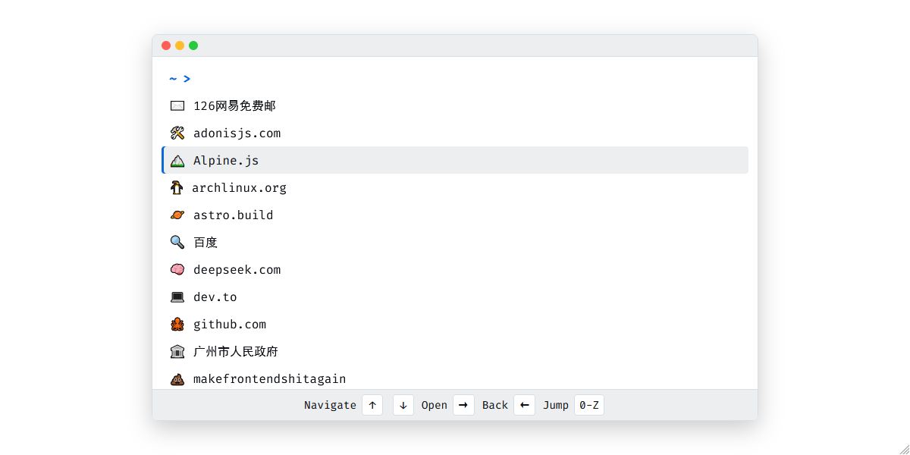

# Terminal-Style Startpage (Alpine.js Version)

A minimalistic browser startpage with terminal-style interface, featuring keyboard navigation and customizable bookmarks. Built with Alpine.js for simplicity and lightweight performance.  



## Features

- **Terminal Aesthetics**: Clean, text-based interface with monospace font
- **Keyboard Navigation**:
  - Arrow keys to navigate entries and open links
  - Letter keys to jump to entries
  - Escape to go back
- **Single File Implementation**: Just one HTML file with no build dependencies
- **Customizable Bookmarks**: Easily edit the JavaScript array to add/remove entries
- **Responsive Design**: Works on all screen sizes

## Installation

1. Clone this repository:
```bash
git clone https://github.com/chenxing-dev/startpage-alpine.git
```

2. Set as browser homepage:
- For qutebrowser, add to config.py:
```python
c.url.start_pages = ["/path/to/startpage-alpine/index.html"]
```

## Customization
Edit the `files` array in the HTML file to customize your bookmarks:
```javascript
files = [
  {
    name: "Example Site",
    icon: "⭐",
    href: "https://example.com"
  },
  // ... other entries
];
```

## Why Alpine.js?
This version uses Alpine.js instead of Svelte/Astro from the [original startpage](https://github.com/chenxing-dev/startpage) for:
- Zero build dependencies
- Single HTML file portability
- Smaller footprint (~331KB)
- Perfect for embedding in dotfiles

## License
MIT License
Copyright (c) 2025 chenxing-dev
